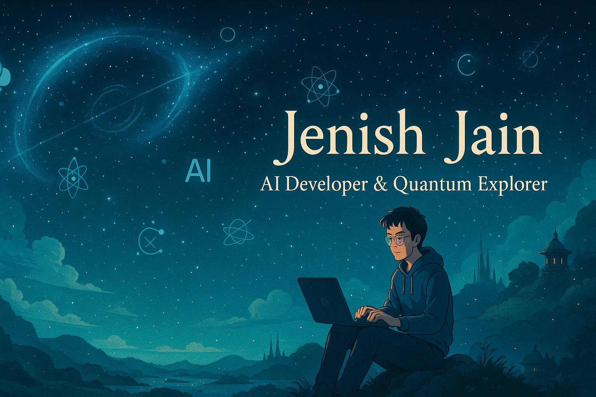

<!-- GitHub Profile Banner -->

  

<!-- Profile Photo and Introduction -->

  

<h1 align="center">Hi 👋, I'm Jenish Jain</h1>

  🚀 Passionate Student | Aspiring AI Researcher | Quantum Computing Enthusiast | Tech Visionary  

  <a href="https://www.canva.com/design/DAGmXdAGFNk/jI5uIdK-P9Q6R81wFIETkw/view?utm_content=DAGmXdAGFNk&utm_campaign=designshare&utm_medium=link2&utm_source=uniquelinks&utlId=h1618a7cafe" target="_blank">
    🔗 Portfolio
  </a> |
  <a href="https://www.linkedin.com/in/your-linkedin/" target="_blank">💼 LinkedIn</a> |
  <a href="mailto:your-email@example.com">📧 Mail</a>

---

## 🧠 About Me

- 🎓 High school student diving deep into **C, Python**, and **AI**
- 🤖 Building AI projects that matter — blending **theory** with **real-world impact**
- 🧠 I have a budding interest in Quantum Computing and love blending theory with real-world applications.
- 🎯 Constantly learning, building, and pushing boundaries in tech!
---

## 💻 Tech Stack & Tools

  

---

## 🔥 GitHub Stats

  
  

  

---

## 🎥 Featured Gifs & Aesthetic

  
  

---

## 📈 Contribution Graph

<picture>
  <source media="(prefers-color-scheme: dark)" srcset="https://raw.githubusercontent.com/tobiasmeyhoefer/tobiasmeyhoefer/output/github-snake-dark.svg" />
  <source media="(prefers-color-scheme: light)" srcset="https://raw.githubusercontent.com/tobiasmeyhoefer/tobiasmeyhoefer/output/github-snake.svg" />
  
</picture>

---

## 🤝 Let's Connect

> I'm always open to exciting ideas, collaborations, or just a good tech chat. Feel free to reach out!

  
  
  

---

> “Code is the language of reality. Let’s rewrite the world line by line.” – Jenish Jain ✨

