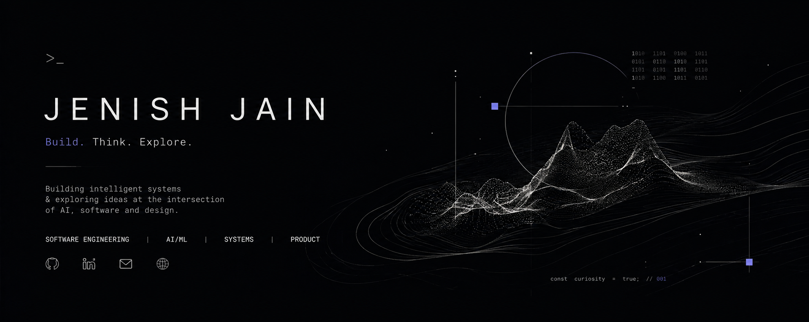

<!-- =========================================================
     JENISH JAIN — GITHUB PROFILE README
     ========================================================= -->

<!-- Hero Banner -->
<p align="center">
  
</p>

<!-- Identity -->
<h1 align="center">Jenish Jain</h1>

<p align="center">
  <strong>Computer Science Engineer • AI Builder • Systems Thinker</strong>
</p>

<p align="center">
  I build intelligent systems, experiment with emerging technologies,<br>
  and turn ambitious ideas into working products.
</p>

<p align="center">
  <a href="https://www.linkedin.com/in/jenish-jain-75ba18295/">
    LinkedIn
  </a>
  •
  <a href="mailto:jenishvkj2007@gmail.com">
    Email
  </a>
  •
  <a href="https://github.com/Jenishjain12">
    GitHub
  </a>
</p>

---

## About

I'm a **Computer Science engineering student** focused on building a strong foundation in software engineering, artificial intelligence, and computational systems.

My interests sit at the intersection of:

- **Artificial Intelligence & Machine Learning**
- **Software Engineering & Product Development**
- **Algorithms & Problem Solving**
- **Quantum Computing**
- **Developer Tools & Automation**
- **Emerging Computing Technologies**

I learn by building — taking concepts from theory, turning them into experiments, and eventually shaping them into usable products.

> **Learn deeply. Build relentlessly. Think beyond the obvious.**

---

## What I'm Building

I'm particularly interested in projects that combine **engineering, intelligence, and real-world utility**.

### AI & Intelligent Systems
Exploring machine learning, deep learning, generative AI, and intelligent automation.

### Software & Products
Building practical applications and developer-focused tools that solve real problems.

### Algorithms & Computer Science
Strengthening my fundamentals through data structures, algorithms, competitive programming, and systems thinking.

### Quantum Computing
Exploring the principles behind quantum computation and where it may intersect with the future of AI and computing.

---

## Technology

<p align="center">


</p>

---

## Engineering Focus

```text
Artificial Intelligence
├── Machine Learning
├── Deep Learning
├── Generative AI
└── Intelligent Automation

Computer Science
├── Data Structures & Algorithms
├── Problem Solving
├── Software Engineering
└── Systems Thinking

Emerging Technology
├── Quantum Computing
├── AI × Developer Tools
└── Human + Machine Collaboration
```

---

## Current Direction

```yaml
learning:
  - Advanced Python
  - Data Structures & Algorithms
  - Machine Learning
  - Deep Learning
  - Generative AI
  - Software Engineering

building:
  - AI-powered applications
  - Automation workflows
  - Developer tools
  - Experimental systems

exploring:
  - Quantum Computing
  - AI Research
  - Intelligent Systems
  - Emerging Computing Paradigms
```

---

## GitHub Activity

<p align="center">
  
  
</p>

<p align="center">
  
</p>

---

## Contribution Graph

<p align="center">
  <picture>
    <source
      media="(prefers-color-scheme: dark)"
      srcset="https://raw.githubusercontent.com/tobiasmeyhoefer/tobiasmeyhoefer/output/github-snake-dark.svg"
    />
    <source
      media="(prefers-color-scheme: light)"
      srcset="https://raw.githubusercontent.com/tobiasmeyhoefer/tobiasmeyhoefer/output/github-snake.svg"
    />
    
  </picture>
</p>

---

## Beyond the Code

I’m interested in the bigger picture of technology — not just how systems work, but **why they should exist and what they can become**.

I'm especially drawn to the space where:

**AI × Software × Science × Entrepreneurship**

meet.

The long-term goal isn't simply to write more code.

It's to **build things that matter.**

---

## Let's Connect

I'm always interested in meeting ambitious builders, engineers, researchers, founders, and curious minds.

If you're building something interesting, exploring AI, or simply want to talk about technology:

**Let's talk.**

<p align="center">
  <a href="https://www.linkedin.com/in/jenish-jain-75ba18295/">
    
  </a>
  <a href="mailto:jenishvkj2007@gmail.com">
    
  </a>
  <a href="https://github.com/Jenishjain12">
    
  </a>
</p>

---

<p align="center">
  <i>"Don't just predict the future. Build it."</i>
</p>
